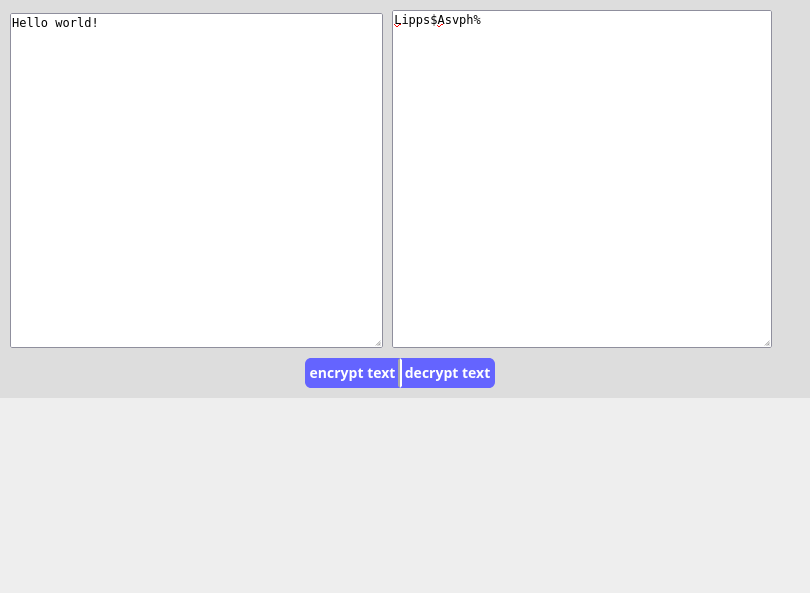

# Simple text encrypt/decrypt webpage


### Hi adventures &#x1f44b;, this is just a simple text encrypt/decrypt webpage.
### created using HTML, CSS and JS

### for this page i used a few javascript methods like :
* javascript string method
    * .indexOf()
* javascript arry method
    * .join()
* javascript for loop

### I hope you like it 

### the code 
```html
<!DOCTYPE html>
<html lang="en">
	<head>
		<meta charset="UTF-8"/>
		<meta http-equiv="X-UA-Compatible" content="IE=edge"/>
		<meta name="viewport" content="width=device-width, initial-scale=1.0"/>
		<title>JS test</title>
		<link rel="icon" type="image/png" href="../src/img/carnival-mask.png"/>
		<style>
			*{
				margin: 0;
				padding: 0;
				box-sizing: border-box;
				-webkit-box-sizing: border-box;
			}
			body{
				height: 100vh;
				background-color: #eee;
			}
			div.operation-div{
				min-width: 260px;
				max-width: 1300px;
				background-color: #ddd;
				margin: 30px auto;
				padding: 10px;
			}
			textarea{
				width: calc((100% - 25px)/2);
				height: 200px;
			}
			textarea:last-of-type{
				margin-left: 5px;
			}
			div.buttons{
				margin: 10px auto 0 auto;
				width: 200px;
				overflow: hidden;
			}
			button{
				float: left;
				width: 95px;
				height: 30px;
				border-color: transparent;
				font-family: sans-serif;
				font-weight: 800;
				color: #fff;
				font-size: 14px;
				background-color: rgb(100, 100, 255);
			}
			button:hover{
				background-color: rgb(0, 0, 255);
			}
			button:active{
				background-color: rgb(100, 100, 255);
			}
			button:first-of-type{
				border-radius: 6px 0 0 6px;
				border-right-color: #fff;
			}
			button:last-of-type{
				border-radius: 0 6px 6px 0;
				border-left-color: #fff;
			}
		</style>
	</head>
	<body>
		<!-- hey gays, this is just a simple text encryption/decryption webpage.
		     I used some HTML, CSS and javascript for it.
		     It is simple and fun, i wish you like it (;
		-->
		<div class="operation-div">
			<textarea id="putedText" placeholder="put here the text you want to encrypt/decrypt"></textarea>
			<textarea id="resoultText" placeholder="here is the resoult!"></textarea>
			<div class="buttons">
				<button onclick='chText("enc")'>encrypt text</button>
				<button onclick='chText("dec")'>decrypt text</button>
			</div>
		</div>
		<script>
			//study hard!!!
			function chText(e){
				let putText = document.getElementById("putedText");
				let resText = document.getElementById("resoultText");
				let dictionaryArry = "abcdefghijklmnopqrstuvwxyzABCDEFGHIJKLMNOPQRSTUVWXYZ !@#$%^&*()-_=+[]{};:'\",<.>/?\\|`~\n\t0123456789";
				let collectArry = "";
				if(e === "enc"){
					collectArry = "";
					for(let i = 0;i < putText.value.length;i++){
						collectArry += dictionaryArry[(dictionaryArry.indexOf(putText.value[i]) + 4) % dictionaryArry.length];
					}
				}else if(e === "dec"){
					collectArry = "";
					for(let i = 0;i < putText.value.length;i++){
						charnum = dictionaryArry.indexOf(putText.value[i]) - 4;
						if(charnum < 0){
							collectArry += dictionaryArry[dictionaryArry.length + charnum];
						}else{
							collectArry += dictionaryArry[charnum];
						}
					}
				}
				resText.value = collectArry;
			}
		</script>
	</body>
</html>
```
